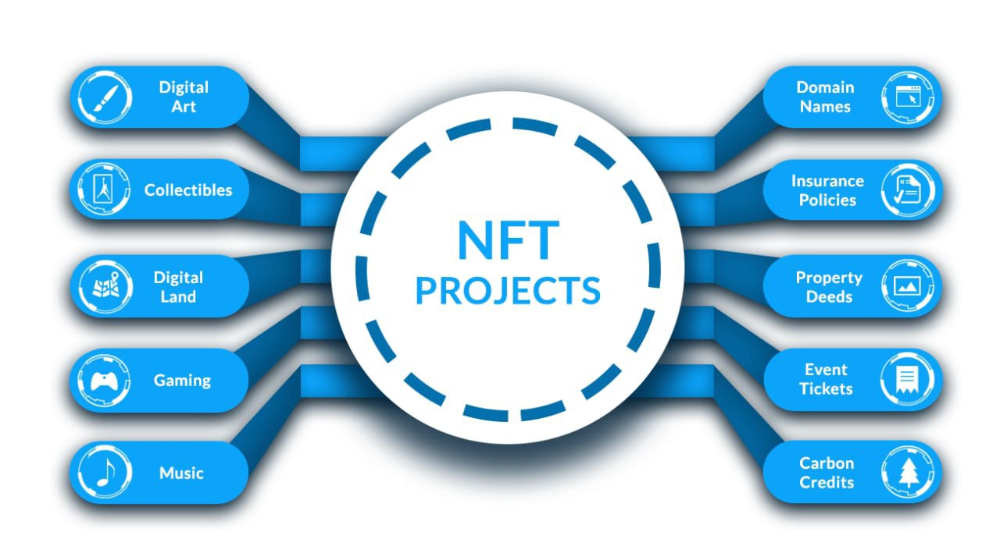

# 🤓 Understanding Nexus

Nexus is a community run project and compared to other VC run projects we differ in our thinking and that reflects in the way Nexus is designed and developed. Nexus is at best a toolbox and will not provide a finished product to users, we believe the community will build applications which will start a symbiotic relationship.

### Good to know:

Nexus is a software stack underpinned by a ledger and interoperates with the OSI (Open Systems Interconnect) stack

Every action on the Nexus network is a contract. When a user sends NXS it is a debit contract to the senders account and a credit contract to the receivers account

Contracts are bundled into a transaction which can contain a max of 100 contracts and each block can do a max of 655 tps

The block size is 2MB and can contain of 32768 tx's (32768\*64=2 MB) where 64 KB is the length of the nexthash. This is theoretical max and if any other arbitrary data in included, then the no of tx's in a block will be reduced.

Wallet has to be online and the user logged in to the account, to accept and credit a incoming transaction

The hash size used for various operations

* 256 bit hash for standard registers
* 512 bit hash for transaction hash
* 1024 bit hash for block hash

Nexus uses a 64 Bit register based Virtual Machine (VM)

&#x20;

## Application Wallet Connect:

As of today the only way that an application can access the user wallet is when the user provides the account credentials, this is not the preferred method &#x20;

#### Nexus 2FA

Nexus has designed 2fa which will be released with the Tritium++ v6.0 update.

In 2fa mode the user just inputs his username into the app, which is sent to its backend node and the data is sent through the Nexus network to the users wallet with a request to connect to the particular dapp. On a successful confirmation the wallet is connected to the dapp via the network. This also offloads all computation to the users wallet and also decentralises the process.

## Fee Structure

Nexus simple transactions are free, but most operations and contract execution will have fees, this is done to protect spamming the network and to avoid some actors from taking undue advantage.

To know and better understand the fee structure click on the link below.


[Broken link](broken-reference)


## Tokens:

Nexus makes it very simple to generate tokens with the UI wallet and as of today we can create fungible and non-fungible tokens. The nexus `Tokens` API can be use to create fungible tokens and the `Assets` API can be use to create Non-fungible tokens

### Fungible Token

A fungible token is something that is identical in nature and interchangeable. These tokens can be divided and exchanged for another. Generally, most [**cryptocurrencies**](https://phemex.com/blogs/what-are-cryptocurrencies) are considered to be fungible. For example, a [**Bitcoin**](https://phemex.com/academy/what-is-bitcoin) is fungible. You can [**trade**](https://phemex.com) one Bitcoin for another, and you will end up with the exact same thing. Other examples of fungible asset classes are bonds, commodities, cryptocurrencies, and precious metals.

### Non-Fungible Token

Non-fungible is something that is distinct or unique and cannot be replaced with something else. A one-of-a-kind trading card is non-fungible. The primary attribute of non-fungibility is uniqueness.

Below image shows the various use-cases which can powered by non fungible tokens


Protected assets will also be available at a later time.


## Names and Namespaces:

Nexus provides native Names and Namespaces which are one of the important things a developer has to take advantage to provide the best user experience.

Names and Namespaces are special kinds of object registers that are used as locators to other object registers in the blockchain. When an object register is first created (an asset for example) the caller can provide a name for the register. If a name is provided then a Name object register is also created with its register address based on a hash of the name. The Name object also has a address field, which is populated with the register address of the register (asset, token, account etc) that the Name "points" to. In this way, objects can be retrieved by name by first hashing the name to get the Name object's address, retrieving the Name object, and then using the address stored within it to retrieve the object register. A Name then, is best thought of as a named index to object registers

Names on Nexus are of three different types:

### Local Names:&#x20;

Local Names are local to a user account (sig chain). To use a local name you must prefix the name with the owners `username` separated by a single colon, e.g. `bob:savings`. This is equivalent to saying "look at all the Names registered in the sig chain `bob` and find one called `savings` and then see what object register it points to". There can only be one Name called `savings` in the sig chain `bob`, but another user `alice` can also create a local name called `savings.`  Creating Names will cost `1 NXS`

### Namespace:&#x20;

Namespace are globally unique keyword and Namespaces allow users to provide user-friendly names for their object registers without needing to disclose their username. This is useful for privacy, but also to allow names to be related to a business or some other meaningful context. To avoid name-squatting registering a namespace name attracts a high fee (`1000 NXS`).


**Good to Know:** Namespace names can only contain **lowercase letters, numbers, and periods (.)**


#### Namespaced:&#x20;

These are created within the context of a namespace, which itself is a globally unique keyword.  To use a namespaced name you must prefix the name with the namespace separated by a double colon, e.g. `bobscoffeeshop::payments`. In this example bob would have first registered the namespace `bobscoffeeshop` and created an account to receive payments to (which could be called anything). He then creates a Name with a `name=payments`, `namespace=bobscoffeeshop` and `address=(register address of the account)`. From then on, anyone can use the name `bobscoffeeshop::payments` and it will resolve to the register address of the account. Creating Names within that namespace costs only `1 NXS`

### Global Names:

Global names require no username or namespace prefix, and are therefore globally unique. These will be likely reserved for use cases where a succinct, unique, name is necessary, for example a token ticker symbol. To avoid needless name-squatting, global names attract a high fee (`2000 NXS`).&#x20;

Global Name registered and linked to a token will be referred by the ticker `NEX` instead of it's register address `8B5pKxGWgBM9nXzucrqmhdy9PuDHxDi41fqosXZsLTUXGfQ4CXn` . This will also be convenient to launch the token on the P2P marketplace or DeFi when available.

