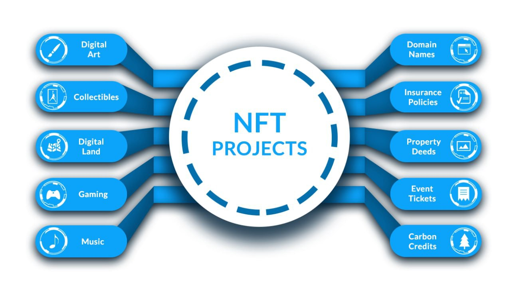

# 📈 Token Types

Nexus API's can issue tokens, assets, items, invoices. What are all the different type of tokens available today

* Fungible Tokens&#x20;
* Non Fungible Tokens (NFT)
* Tokenised Assets
* Supply Chain
* Invoice
* Document verification, File Encryption / decryption

