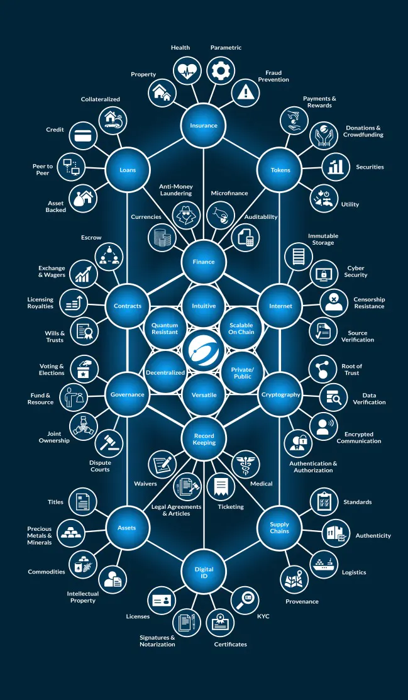

# Use-Cases on Nexus


This section is being updated and is a work in progress


Nexus can encompass a lot of use-cases today using API's and with the upcoming Tritium++ we will bring in the more powerful developer tools with Advanced Contracts and security to interact with dapps.

### Use-cases Using Nexus


[assets-nfts](assets-nfts/)



[asset-tokenization.md](assets-nfts/asset-tokenization.md)



[supply-chain-track-and-trace.md](supply-chain-track-and-trace.md)



[gaming.md](gaming.md)



[certificates.md](certificates.md)

