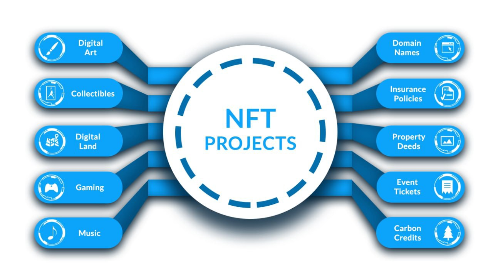

# Assets - NFT's

### **What is an Asset (NFT)?**

Assets, commonly known as NFT's stand for non-fungible token. Assets are tokens that we can use to represent ownership of unique items. They let us digitally represent things like art, collectibles, even real estate and a lot of other things. They can only have one official owner (sigchain) at a time and they're secured by the Nexus blockchain;  except the owner no one can modify the record of ownership.

An Asset can only have one owner (user account / sigchain) at a time. Ownership is managed through the uniqueID (Asset Name) and metadata that no other token can replicate. Assets are minted and are assigned ownership to the particular user account (Sigchain).&#x20;

NFT's can be transferred to other users which transfers the ownership of the Asset to that particular user. Assets provide the use of mutable metadata like the "_Owner Field"_ for a house which is minted as an asset. The new owner then can change the Owner field to reflect his name as the owner of the house.

### Asset  Properties:

* Each Asset minted has a unique Name & Register Address that is directly linked to the owner (user account / sigchain).
* Assets are not directly interchangeable with other tokens 1:1. For example 1 NXS is exactly the same as another ETH. This isn't the case with Assets.
* Each Asset has an owner and this information is easily verifiable.
* Assets are native to Nexus and can be bought and sold on any Nexus powered Asset market or via the on-chain P2P marketplace.
* Asset metadata fields can be selected as mutable during minting and this metadata can be changed anytime by the owner of that Asset.
* Assets can be tokenised for fractional ownership.

### Where can we use Assets?

Assets can be used for various use-cases both digital and physical. Listed below are a few use-cases:

#### Digital:

* Digital Art
* GIFs
* Collectibles
* Music
* Videos
* Digital Land

#### Real World  (Physical):

* Asset tokenization
* Property Deeds&#x20;
* Deeds to a car
* Events & Ticketing
* Secure Digital Identity
* Legal documents
* Academic Credentials / Certificates
* Intellectual Property
* Ensuring Authenticity of Products
* Gaming: In Game Characters and Assets
* Physical Art
* Insurance
* Domain Names

This list is just the tip of the iceberg, there are a lot of ways to use Assets, creativity is the limit here.\
