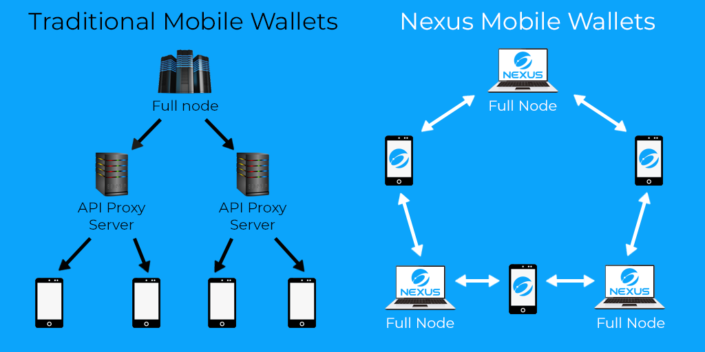

# 📱 Mobile Wallet


The mobile wallet is in private beta and will be launched in 2022


For any blockchain platform to be remotely successful it needs to make the technology easy and  accessible to normal people. Nexus achieves this with a truly decentralized mobile wallet and signature chains.&#x20;

Signature chain make it easy to manage assets with only username, password and pin, this help in case the smartphone is lost or stops working, dont fret, just install the mobile wallet on the new phone, login and you have your assets back.

This puts the Nexus technology in very persons hand, combine that with the free transactions and ease of building dapps with API's which the developers can use this to this benefit, which in-turn will create utility for Nexus.

Traditionally, mobile wallets use a central node run by the wallet designer to communicate with the rest of the network**.** The central node acts as a trusted proxy and is the sole provider of information regarding blockchain state. The Nexus wallet, on the other hand, runs the same desktop core, operates as a lite node by downloading a list of peers from the network seed nodes and forming connections to several of its peers. This allows the wallet to broadcast transactions directly to the network and detect confirmations by checking for inclusion against block headers. The Nexus mobile wallet gains added security by being able to verify block headers provided by multiple peers instead of through one central node. For the tech-savvy, this is also known as [Simplified Payment Verification](https://wiki.bitcoinsv.io/index.php/Simplified\_Payment\_Verification).

Following the principle of the Nexus [software stack](https://tech.nexus.io/software-stack), new mobile dapps will be able to interface and interact with the local wallet instead of relying on a separate server to obtain information regarding blockchain state. The Nexus mobile wallet is also completely non-custodial, meaning that your [signature chain](https://tech.nexus.io/signature-chains) remains completely private. All transactions are processed and packaged on the local device and then broadcast to the rest of the network, just like a full node.&#x20;

By necessity, the Nexus mobile wallet will only store and process block headers and the user's signature chain, starting with the hash of the very first Tritium block hard-coded into the wallet. For an advanced user running their own full node and certain API functionality, it is possible to enable the mobile wallet to establish a direct connection. This enables a user to offload heavy computational work to their desktop node, such as searching through historical data or maintaining a full copy of the blockchain.&#x20;

\
